CFB Cluster Analysis
================

# Introduction

In this post, I will do a cluster analysis to find the tiers of college
football (CFB) teams for the 2020 season. It will be interesting to see
which teams end up in each cluster to see which teams player similarly.

# Data

The data that I will be using is from the
[cfbscrapR](https://github.com/saiemgilani/cfbscrapR) package. I will
only be using data from the 2020 season because this was the most recent
season. As this dataset has 79 variables, I will do a dimensionality
reduction technique (PCA) to reduce the dimensions and then form the
clusters based on these new dimensions.

# Principal Component Analysis (PCA)

``` r
cfb <- as.data.frame(season_adv_2020)

row.names(cfb) <- cfb$team

cfb <- cfb %>%
  select(-season, -conference, -team)
```

## Confirm That the Data is Metric

The data must be metric in order to do PCA. In other words, 1 is less
than 2 which is less than 3 and so forth.

``` r
summary(cfb)
```

## Scale the Data

Currently, each variable has a different range of numbers. This could
cause an issue because those numbers with larger ranges could have
higher variation causing PCA to favor these variables more. Thus, the
data must be scaled to have a mean of 0 and standard deviation of 1 in
order to prevent this.

``` r
cfb = scale(cfb)
cfb = as.data.frame(cfb)
```

## Check Correlations

I need large correlations (\>0.5) because the grouping that I am doing
groups raw attributes that are highly correlated. Thus, I will use the
correlation matrix to observe the correlation between variables.

``` r
thecor = round(cor(cfb),2)
colnames(thecor)<-colnames(cfb)
rownames(thecor)<-colnames(cfb)
head(round(thecor[,1:5],2))
```

    ##                   off_plays off_drives off_ppa off_total_ppa off_success_rate
    ## off_plays              1.00       0.97    0.25          0.62             0.27
    ## off_drives             0.97       1.00    0.15          0.54             0.17
    ## off_ppa                0.25       0.15    1.00          0.86             0.91
    ## off_total_ppa          0.62       0.54    0.86          1.00             0.79
    ## off_success_rate       0.27       0.17    0.91          0.79             1.00
    ## off_explosiveness      0.00       0.01    0.39          0.33             0.03

There are a decent number of variables that are moderately correlated
and few that have a strong positive correlation. Maybe these can be
grouped together.

## Choose the Number of Components

I use PCA to generate derived variables from the raw data. Thus, I can
capture most of the data in just a few factors.

``` r
# conduct PCA analysis with prcomp function
# creats PCA output object
pca_out = prcomp(cfb, scale = TRUE)

# now that we have checked that
# we can dive into the PCA results a bit more
# this "get_pca_var" gives us the PCA information for the variables in our data
res_var = get_pca_var(pca_out)

# look at PCA coordinates 
head(res_var$coord[,1:10])
```

    ##                       Dim.1        Dim.2      Dim.3       Dim.4        Dim.5
    ## off_plays         0.4068630 -0.302932715  0.7659230 -0.35110839  0.006866887
    ## off_drives        0.3481350 -0.237164108  0.8251693 -0.33306678 -0.047066712
    ## off_ppa           0.7702051 -0.482389420 -0.1768441  0.21135947  0.238541827
    ## off_total_ppa     0.7625582 -0.501456394  0.2181026  0.03865565  0.190372480
    ## off_success_rate  0.7303357 -0.521640134 -0.2379789 -0.01057107  0.223247781
    ## off_explosiveness 0.2471025  0.008838479  0.1522446  0.58413727  0.195357858
    ##                         Dim.6       Dim.7         Dim.8      Dim.9       Dim.10
    ## off_plays         -0.02698007  0.04962870 -0.0003371262 0.03472544  0.012528125
    ## off_drives         0.01634519  0.03661969  0.0406026947 0.04916243  0.040477045
    ## off_ppa            0.08326258 -0.05136020 -0.0254231088 0.04629915 -0.016937057
    ## off_total_ppa      0.05864073 -0.04862322 -0.0007749608 0.05528876 -0.008957374
    ## off_success_rate  -0.16578820 -0.03605283  0.1041489476 0.03264196 -0.027070127
    ## off_explosiveness  0.66079926 -0.14561269 -0.1770216908 0.01383941  0.052700907

By looking at these coordinates we can ‘see’ where the data is ‘loading’
on the PCA projection. There are currently as many factors as features
so now the work begins on reducing dimensions while trying to keep as
much information as possible.

To see how much of the raw data is captured by the factors, I will be
using the *percentage of variance explained* by components and the
*eigenvalue coresponding to the component*. The sum of percents is 100%
and the number of eigenvalues is equal to the original number of
features.

``` r
eig_val = get_eigenvalue(pca_out)
eig_val[1:10,]
```

    ##        eigenvalue variance.percent cumulative.variance.percent
    ## Dim.1   19.781602        26.028424                    26.02842
    ## Dim.2   12.605369        16.586011                    42.61444
    ## Dim.3    7.513699         9.886446                    52.50088
    ## Dim.4    5.577141         7.338343                    59.83922
    ## Dim.5    4.878143         6.418609                    66.25783
    ## Dim.6    2.931189         3.856828                    70.11466
    ## Dim.7    2.774761         3.651002                    73.76566
    ## Dim.8    2.299439         3.025578                    76.79124
    ## Dim.9    2.214707         2.914088                    79.70533
    ## Dim.10   1.888695         2.485124                    82.19045

I could choose eigenvalues greater than than the mean (1); however,
there are 13 factors with an eigenvalue greater than 1 so I must look
elsewhere to determine factors

## Visualize

### Scree Plot

I can also make a scree plot to determine the dimensions.

``` r
# visualize and inspect results
# factoextra package
fviz_eig(pca_out)
```

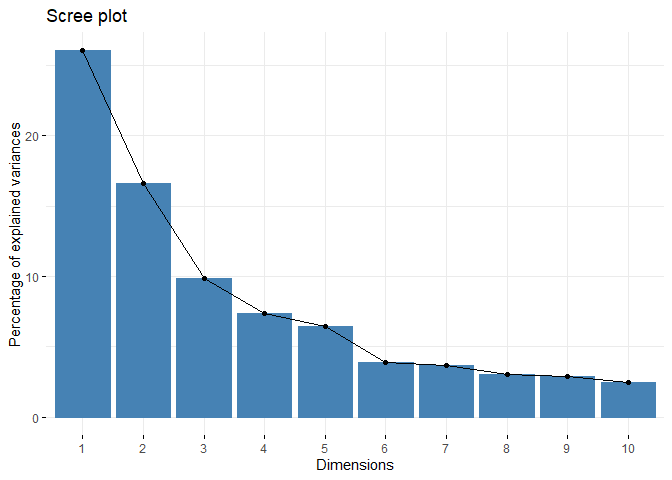<!-- -->

I will choose four factors because this is where the “elbow” is in the
scree plot.

### Variable Contribution

I can determine which variables have the highest contribution on the
construction of the PCs. I only use the top 4 to keep the graph
interpretable.

``` r
fviz_pca_var(pca_out,
             select.var = list(contrib = 4),
             col.var = "contrib", # Color by contributions to the PC
             gradient.cols = c("#00AFBB", "#E7B800", "#FC4E07"),
             repel = TRUE     # Avoid text overlapping
             )
```

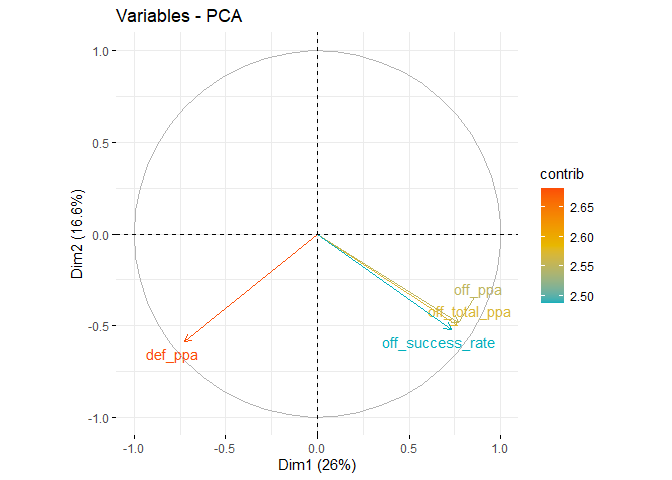<!-- -->

It looks like predicted points added (PPA) has the highest contribution
for offense and defense.

### Biplot

I can also do a biplot to determine what makes teams similar to each
other. Again, I only use the 4-most contributing variables to keep the
graph as interpretable as possible.

``` r
fviz_pca_biplot(pca_out,
                select.var = list(contrib = 4),
                col.var = "black",
                col.ind = "steelblue",
                repel = TRUE)
```

    ## Warning: ggrepel: 64 unlabeled data points (too many overlaps). Consider
    ## increasing max.overlaps

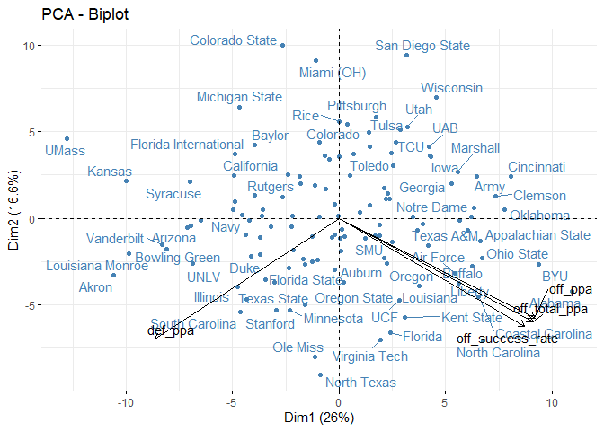<!-- -->

Vanderbilt (my school), UMass, Kansas, Louisiana Monroe, and Akron are
teams with better defenses than offenses. Coastal Carolina, Alabama,
BYU, Ohio St., and Cincinnati are teams with better offenses.

## Save scores

I have chosen 4 components so I will plot the contributions of variables
to each component.

``` r
# Contributions of variables to PC1
fviz_contrib(pca_out, choice = "var", axes = 1, top = 25)
```

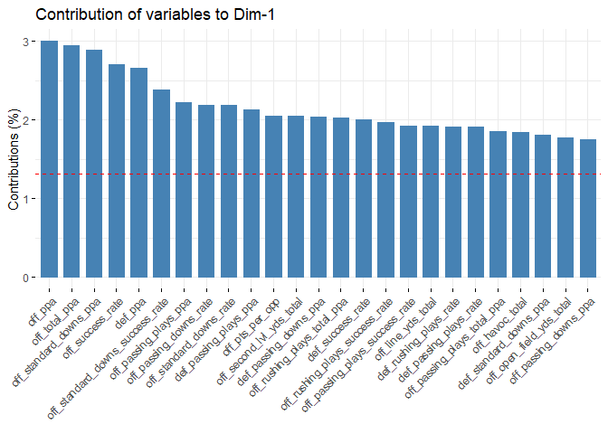<!-- -->

``` r
fviz_contrib(pca_out, choice = "var", axes = 2, top = 25)
```

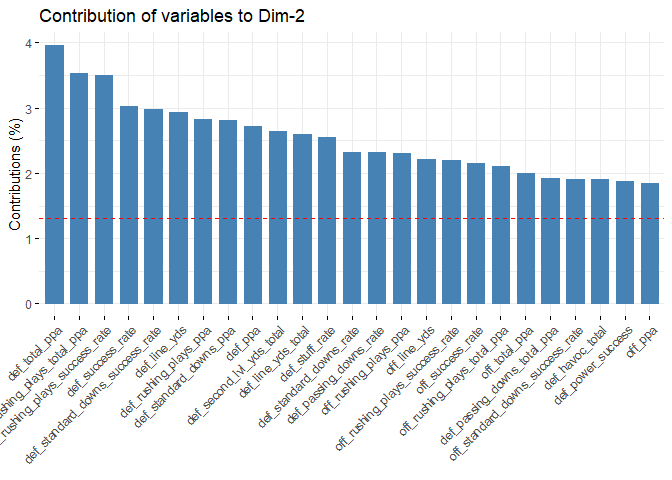<!-- -->

``` r
fviz_contrib(pca_out, choice = "var", axes = 3, top = 25)
```

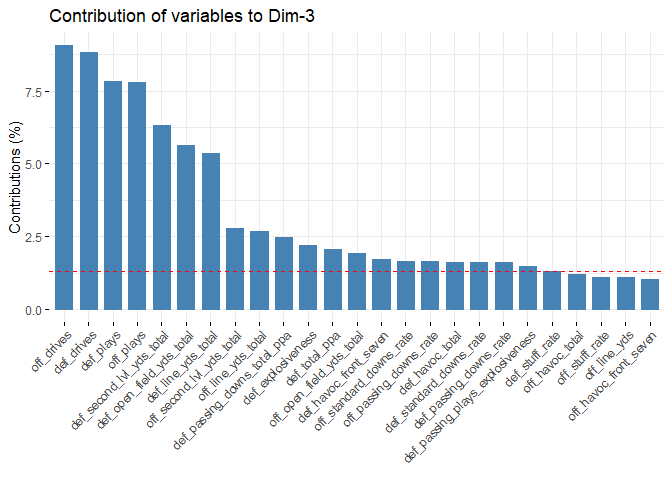<!-- -->

``` r
fviz_contrib(pca_out, choice = "var", axes = 4, top = 20)
```

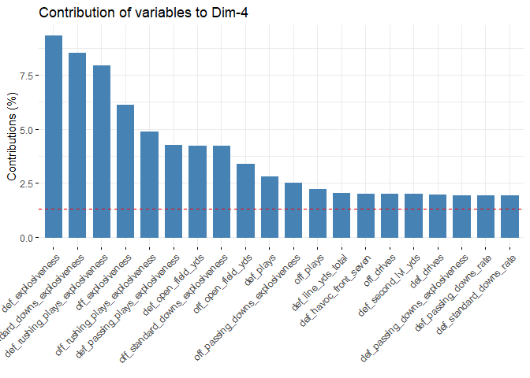<!-- -->

``` r
cfb_pca <- pca_out$x[,1:4]
```

# Cluster Analysis

Now that I have reduced the dimensions of my data frame, I can do a
cluster analysis on the new factors that I created doing PCA.

## Determine Optimal Number of Clusters

Just as I did during PCA, I will create an elbow plot to determine the
number of clusters.

``` r
cfb_pca <- as.data.frame(cfb_pca)

fviz_nbclust(cfb_pca, kmeans, method = "wss") +
    geom_vline(xintercept = 4, linetype = 2)+
  labs(subtitle = "Elbow method")
```

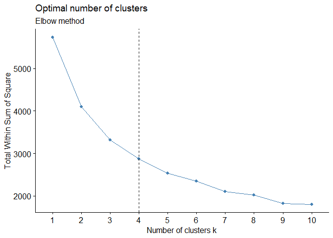<!-- -->

From the elbow method, it looks like k=3, k=4, or k=5 will be the
optimal value. I will see how well each cluster amount works and
determine from there.

``` r
final_3 <- kmeans(cfb_pca, centers = 3, nstart = 25)
finalplot_3 <- fviz_cluster(final_3, data = cfb_pca, labelsize = 7) + ggtitle("k = 3") 
finalplot_3
```

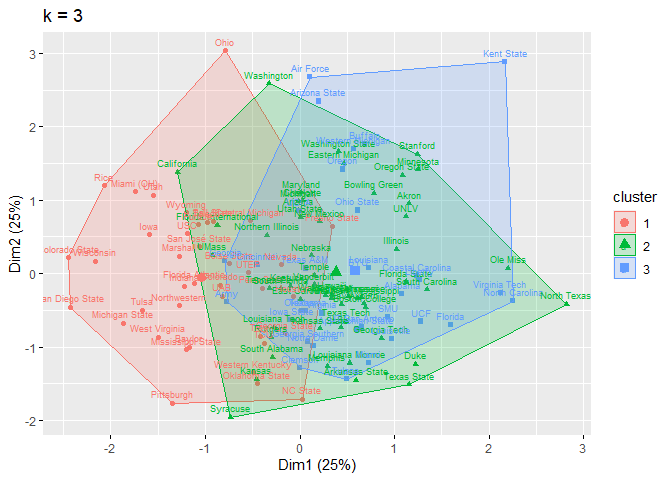<!-- -->

``` r
final_4 <- kmeans(cfb_pca, centers = 4, nstart = 25)
finalplot_4 <- fviz_cluster(final_4, data = cfb_pca, labelsize = 7) + ggtitle("k = 4") 
finalplot_4
```

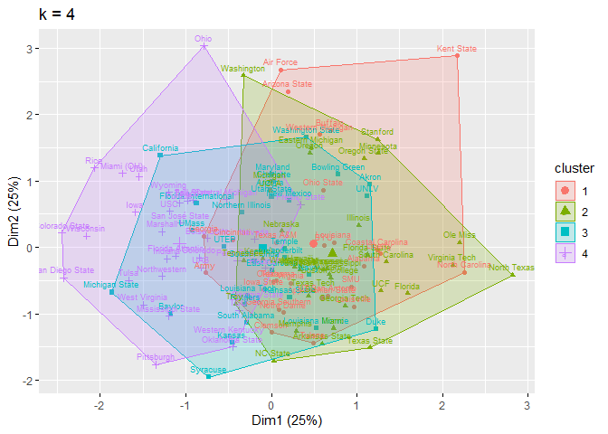<!-- -->

``` r
final_5 <- kmeans(cfb_pca, centers = 5, nstart = 25)
finalplot_5 <- fviz_cluster(final_5, data = cfb_pca, labelsize = 7) + ggtitle("k = 5") 
finalplot_5
```

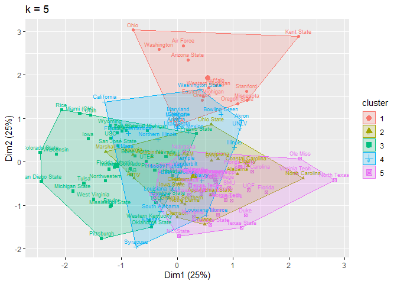<!-- -->

``` r
cfb_pca$final_3 <- as.factor(final_3$cluster)
cfb_pca$final_4 <- as.factor(final_4$cluster)
cfb_pca$final_5 <- as.factor(final_5$cluster)
```

# Visualization

``` r
var_explained <- pca_out$sdev^2/sum(pca_out$sdev^2)

cfb_pca %>% 
  as.data.frame %>%
  rownames_to_column("team") %>%
  ggplot(aes(x=PC1,y=PC2, label=team)) +
  geom_label(aes(colour = final_4), size = 2.5)+
  labs(x=paste0("PC1: ",round(var_explained[1]*100,1),"%"),
       y=paste0("PC2: ",round(var_explained[2]*100,1),"%"))+
  theme(legend.position="top")
```

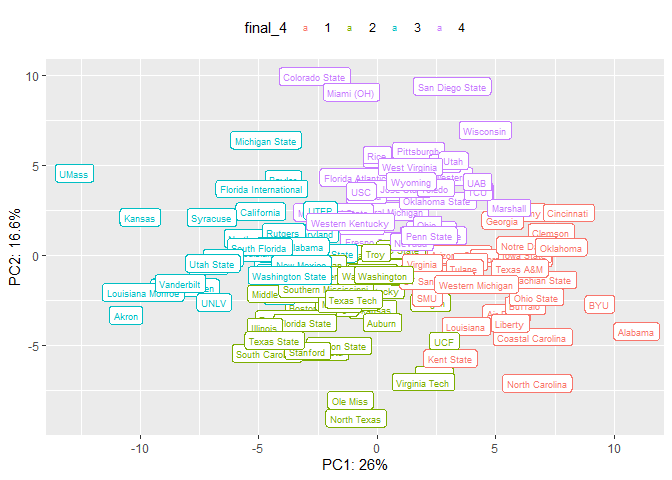<!-- -->

``` r
fviz_cluster(final_4, data = cfb,
             palette = c("#2E9FDF", "#00AFBB", "#E7B800", "#FC4E07"),
             ellipse.type = "euclid",
             # star.plot = TRUE, 
             ggtheme = theme_minimal())
```

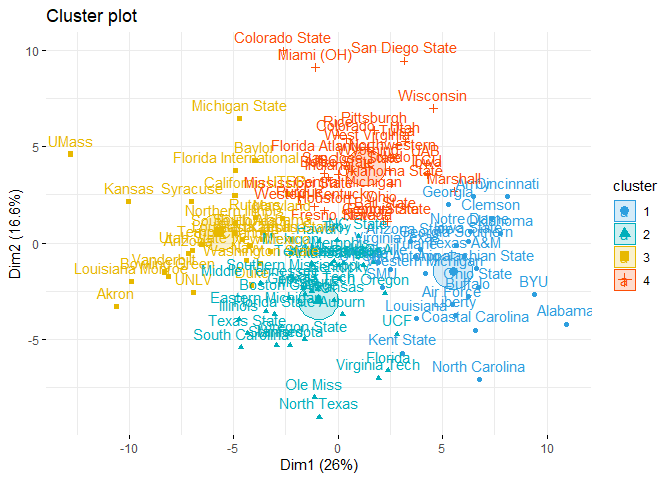<!-- -->

# Results

I can determine which teams are similar to each other now that I have
clustered the teams together

``` r
cfb_pca %>% 
  filter(final_4 == 1)
```

    ##                         PC1         PC2        PC3         PC4 final_3 final_4
    ## Air Force          5.447941 -3.20704592 -8.3661289 -2.41648138       3       1
    ## Alabama           10.938213 -4.20002549  0.7698053 -0.82214950       3       1
    ## Appalachian State  6.627674 -1.32938826  2.5866472  0.86914619       3       1
    ## Arizona State      3.471475  0.07259614 -5.0849474  4.62474213       3       1
    ## Army               6.471428  2.39614609  0.4508843 -1.37650857       3       1
    ## Buffalo            6.251470 -2.76715983 -4.2753023  1.75517717       3       1
    ## BYU                9.384615 -2.68522557 -0.2376807 -0.83647833       3       1
    ## Cincinnati         8.082574  2.38908153  0.1091547  1.66061534       3       1
    ## Clemson            7.350154  1.29037079  3.9804946  1.05615415       3       1
    ## Coastal Carolina   6.561894 -4.51311762  0.3934727  0.04563682       3       1
    ## Georgia            5.289890  1.97787985 -1.2339520 -1.71602997       3       1
    ## Georgia Southern   5.649573 -0.12004541  2.4151864 -0.76217226       3       1
    ## Iowa State         6.224108  0.09641299  1.3402206 -1.30935089       3       1
    ## Kent State         3.083271 -5.70645469 -4.9365793  8.34438620       3       1
    ## Liberty            5.618124 -3.74110686  1.1432465  1.81585792       3       1
    ## Louisiana          3.759687 -3.91731836 -0.8498962 -2.42432016       3       1
    ## Louisville         1.919294 -1.01221310  4.1292739  4.17604115       3       1
    ## North Carolina     6.744372 -7.08546545  2.2625287  2.03527144       3       1
    ## Notre Dame         6.320634  0.57804403  3.1584671  1.02761327       3       1
    ## Ohio State         6.717312 -2.28539092 -1.9621011  1.02181360       3       1
    ## Oklahoma           7.758810  0.47368893  1.7147109  0.79468917       3       1
    ## SMU                2.110391 -2.29706461  2.4250011  1.60308179       3       1
    ## Texas              3.922842 -0.33206527  1.0713707 -1.16549332       3       1
    ## Texas A&M          6.023625 -0.68859832 -0.4730763 -0.87493995       3       1
    ## Tulane             3.690977 -0.69300568  4.3611652  0.50986552       3       1
    ## UT San Antonio     2.514887 -1.36366066  2.6399540  1.23949185       3       1
    ## Virginia           1.905003 -0.40031530  1.6699080  0.24738578       3       1
    ## Western Michigan   4.185760 -1.58039887 -3.6497764  3.19908834       3       1
    ##                   final_5
    ## Air Force               1
    ## Alabama                 2
    ## Appalachian State       2
    ## Arizona State           1
    ## Army                    2
    ## Buffalo                 1
    ## BYU                     2
    ## Cincinnati              2
    ## Clemson                 2
    ## Coastal Carolina        2
    ## Georgia                 2
    ## Georgia Southern        2
    ## Iowa State              2
    ## Kent State              1
    ## Liberty                 2
    ## Louisiana               2
    ## Louisville              5
    ## North Carolina          2
    ## Notre Dame              2
    ## Ohio State              2
    ## Oklahoma                2
    ## SMU                     5
    ## Texas                   2
    ## Texas A&M               2
    ## Tulane                  2
    ## UT San Antonio          5
    ## Virginia                5
    ## Western Michigan        1

``` r
cfb_pca %>% 
  filter(final_4 == 2)
```

    ##                              PC1         PC2        PC3        PC4 final_3
    ## Arkansas             -0.19837376 -2.96251490 -0.2794792 -3.9771731       2
    ## Arkansas State        0.03971973 -1.16720015  4.3425015  0.2738777       2
    ## Auburn                0.22027697 -3.71164945  0.3148190 -3.0278984       2
    ## Boston College       -2.34194308 -2.86268381  1.0733101 -1.1972742       2
    ## Eastern Michigan     -3.44332014 -3.53875014 -4.7655142 -1.8522110       2
    ## Florida               2.39899274 -6.62920311  1.5347290 -2.4563449       3
    ## Florida State        -3.04524331 -3.72115069  0.8210029  0.7247048       2
    ## Georgia Tech         -1.27017076 -2.52415833  2.7759399  0.2316094       2
    ## Hawai'i              -0.91249027  0.07326877  1.6505075  2.3763106       2
    ## Illinois             -4.74365161 -3.95448748 -0.6931756  0.0253292       2
    ## Kentucky              0.07726995 -1.90021070 -1.1360194 -4.8711539       2
    ## LSU                  -1.68448713 -2.33063792  1.3875878 -2.4383872       2
    ## Memphis               0.13466288 -0.66616321  3.4011169 -0.7328197       2
    ## Miami                 1.23213061 -1.15956855  4.1548225  1.6105752       3
    ## Michigan             -2.24781803 -0.47329666 -2.7285725  0.1746375       2
    ## Middle Tennessee     -3.70265990 -2.10602086  0.7339522 -0.8196666       2
    ## Minnesota            -2.30411406 -5.30204660 -3.6242860  0.3333783       2
    ## Missouri             -1.57894311 -2.66997985  0.7515857 -0.9470361       2
    ## NC State              0.98845802  0.34333202  4.4558682 -1.2141203       1
    ## Nebraska             -0.19332774 -0.95305608 -0.9035207 -0.7043467       2
    ## North Texas          -0.89592561 -9.02368231  2.5843895  2.2610449       2
    ## Ole Miss             -1.13341622 -8.01829098  0.3892634  0.2738573       2
    ## Oregon                2.24404038 -2.60119744 -3.9778041 -0.1522833       3
    ## Oregon State         -1.60930593 -4.99483274 -3.6816690 -0.3631717       2
    ## South Carolina       -4.64531932 -5.40841862  0.5343548 -1.2165421       2
    ## Southern Mississippi -2.15824094 -1.81952034  1.2555805  0.4329153       2
    ## Stanford             -2.93725730 -5.28826948 -4.1316800  0.6119743       2
    ## Tennessee            -1.26558277 -1.08523181 -1.1363485 -4.9390723       2
    ## Texas State          -4.33154495 -4.70525729  3.6209526 -2.8480556       2
    ## Texas Tech           -0.98847339 -2.41105532  1.2736039 -2.0876064       2
    ## Troy                 -0.05056582  0.15352786  1.0360612 -3.9281348       1
    ## UCF                   2.82647541 -4.72966099  1.8701190 -0.8401383       3
    ## UCLA                  1.70547141 -1.01244875 -2.7651150 -1.0616713       3
    ## Virginia Tech         1.93761092 -7.01129849  1.6776248  1.3128494       3
    ## Wake Forest          -0.34053034 -1.10362923  0.7279094 -0.5898536       2
    ## Washington            0.27718846 -1.06194088 -7.8874184 -1.4022939       2
    ##                      final_4 final_5
    ## Arkansas                   2       5
    ## Arkansas State             2       5
    ## Auburn                     2       5
    ## Boston College             2       5
    ## Eastern Michigan           2       1
    ## Florida                    2       5
    ## Florida State              2       5
    ## Georgia Tech               2       5
    ## Hawai'i                    2       5
    ## Illinois                   2       4
    ## Kentucky                   2       5
    ## LSU                        2       5
    ## Memphis                    2       5
    ## Miami                      2       5
    ## Michigan                   2       4
    ## Middle Tennessee           2       5
    ## Minnesota                  2       1
    ## Missouri                   2       5
    ## NC State                   2       5
    ## Nebraska                   2       5
    ## North Texas                2       5
    ## Ole Miss                   2       5
    ## Oregon                     2       1
    ## Oregon State               2       1
    ## South Carolina             2       5
    ## Southern Mississippi       2       5
    ## Stanford                   2       1
    ## Tennessee                  2       5
    ## Texas State                2       5
    ## Texas Tech                 2       5
    ## Troy                       2       5
    ## UCF                        2       5
    ## UCLA                       2       1
    ## Virginia Tech              2       5
    ## Wake Forest                2       5
    ## Washington                 2       1

``` r
cfb_pca %>% 
  filter(final_4 == 3)
```

    ##                              PC1        PC2           PC3         PC4 final_3
    ## Akron                 -10.604349 -3.3034219 -1.396233e+00  3.16564888       2
    ## Arizona                -7.132742 -0.5482668 -2.508254e+00 -0.13302577       2
    ## Baylor                 -3.962413  4.2429262  2.116650e+00 -1.42100867       1
    ## Bowling Green          -8.110786 -1.7702311 -1.715459e+00  3.67674409       2
    ## California             -4.921483  2.4593161 -5.222339e+00 -3.01543832       2
    ## Charlotte              -4.196338 -0.1345901 -2.426474e+00  1.17891995       2
    ## Duke                   -4.120653 -2.1988241  4.835081e+00  3.19624926       2
    ## East Carolina          -3.607636  0.1436880  9.703096e-01 -0.09792054       2
    ## Florida International  -4.878713  3.7184735 -1.451514e+00  1.87916108       2
    ## Kansas                -10.006002  2.1457577  3.690731e+00 -0.86028152       2
    ## Kansas State           -2.209961  0.1507900  2.515996e+00  1.00315896       2
    ## Louisiana Monroe       -9.879112 -2.0355404  3.002159e+00 -1.73588047       2
    ## Louisiana Tech         -4.566068  0.1723439  1.139965e+00 -2.65507690       2
    ## Maryland               -2.658418  1.2309357 -1.795052e+00  4.01853170       2
    ## Michigan State         -4.700781  6.4278247  9.163284e-01 -1.75864106       1
    ## Navy                   -4.365873 -0.9434387  1.577121e+00  0.87677741       2
    ## New Mexico             -3.207515 -0.4764448 -1.460482e+00  1.51044854       2
    ## Northern Illinois      -4.896641  0.9698630 -1.547671e+00  0.04727298       2
    ## Rutgers                -3.946074  1.3089432  2.149316e+00 -0.69161996       2
    ## South Alabama          -3.573598  0.5202975  2.317837e+00 -2.56608515       2
    ## South Florida          -4.958829  0.4856932  2.913357e-01 -0.75469250       2
    ## Syracuse               -6.985557  2.1218367  4.165885e+00 -3.66765364       2
    ## Temple                 -6.496637 -0.1056651  4.108074e-01  0.92268429       2
    ## UMass                 -12.776963  4.5922663 -4.122066e-05  2.79916545       2
    ## UNLV                   -6.884566 -2.5920930 -5.706448e-01  4.17005558       2
    ## Utah State             -6.939317 -0.4244495 -2.129692e+00  0.13064073       2
    ## UTEP                   -2.406710  2.5161893  1.896142e-01  1.05746689       1
    ## Vanderbilt             -8.308340 -1.5299684 -2.504834e-01 -2.15132094       2
    ## Washington State       -3.689004 -1.0859768 -3.638547e+00  2.95875178       2
    ##                       final_4 final_5
    ## Akron                       3       4
    ## Arizona                     3       4
    ## Baylor                      3       3
    ## Bowling Green               3       4
    ## California                  3       4
    ## Charlotte                   3       4
    ## Duke                        3       5
    ## East Carolina               3       4
    ## Florida International       3       4
    ## Kansas                      3       4
    ## Kansas State                3       5
    ## Louisiana Monroe            3       4
    ## Louisiana Tech              3       4
    ## Maryland                    3       4
    ## Michigan State              3       3
    ## Navy                        3       4
    ## New Mexico                  3       4
    ## Northern Illinois           3       4
    ## Rutgers                     3       4
    ## South Alabama               3       4
    ## South Florida               3       4
    ## Syracuse                    3       4
    ## Temple                      3       4
    ## UMass                       3       4
    ## UNLV                        3       4
    ## Utah State                  3       4
    ## UTEP                        3       3
    ## Vanderbilt                  3       4
    ## Washington State            3       4

``` r
cfb_pca %>% 
  filter(final_4 == 4)
```

    ##                             PC1       PC2         PC3         PC4 final_3
    ## Ball State         2.2818271303 1.4183028 -3.27156702 -3.11207940       1
    ## Boise State        0.0002436566 3.5454357  0.03636816  1.80929637       1
    ## Central Michigan   0.4954840182 2.4844081 -1.49484416  2.02013614       1
    ## Colorado           0.3981077105 5.4081875  1.77147794  4.59919088       1
    ## Colorado State    -2.6349679314 9.9583698 -0.44205763  2.22191049       1
    ## Florida Atlantic  -0.9131157144 4.3587460  0.21688686  0.33003080       1
    ## Fresno State      -0.2267693279 0.7964216 -0.07208014  5.08439388       1
    ## Georgia State      2.3701966695 1.1218337  2.32008107  0.09322539       1
    ## Houston           -0.6491310124 1.6709704  1.69682688  2.49010517       1
    ## Indiana           -0.4618030211 3.3785379 -0.60817484 -2.49446626       1
    ## Iowa               4.2885930354 3.5534035 -3.21826177 -4.06858295       1
    ## Marshall           5.5537294541 2.6720301 -2.25652838 -3.91122030       1
    ## Miami (OH)        -1.0870081262 9.0920980 -1.26754710  6.96728976       1
    ## Mississippi State -1.8573173780 2.4223628  0.88475856 -5.41124637       1
    ## Nevada             1.4535879196 0.7693833 -0.30802980  0.25841670       1
    ## Northwestern       2.6678424469 4.4075205  0.55345442 -1.17392558       1
    ## Ohio               2.1197330344 1.7203671 -8.32951699  1.41265061       1
    ## Oklahoma State     2.5517973609 3.0577043  4.47714226  0.99055041       1
    ## Penn State         2.1915511725 1.1195211  0.15148870 -0.95335943       1
    ## Pittsburgh         1.7390970257 5.8321523  4.55261164 -0.46689685       1
    ## Purdue            -1.8233942586 1.9923572 -3.18653766 -3.17105161       1
    ## Rice              -0.0021532237 5.5976694 -4.74373840 -2.63070943       1
    ## San Diego State    3.1576485312 9.4217882  0.88562511  0.43636878       1
    ## San José State     0.6888602872 3.7275291 -1.24925610  0.10111124       1
    ## TCU                4.2611539886 3.5872106  3.70702336  3.35945357       1
    ## Toledo             2.4708821104 3.7670534 -1.82945035  1.19733112       1
    ## Tulsa              2.8528746738 5.1277506  0.12944644 -2.70413328       1
    ## UAB                4.2315314256 4.1043360  1.29409016  1.86116509       1
    ## USC               -0.6768144773 3.5901396 -2.11374380 -0.91759610       1
    ## Utah               3.2195606848 5.2882009 -3.21406857  0.51680458       1
    ## Western Kentucky  -1.1366531976 1.8811100  3.19970676 -1.58438847       1
    ## West Virginia      1.3946921814 4.9413036  1.38110221 -2.24933760       1
    ## Wisconsin          4.5535761329 6.9765367 -1.57778680 -1.78818476       1
    ## Wyoming            1.4320437617 4.1392538 -2.46020099  0.50677336       1
    ##                   final_4 final_5
    ## Ball State              4       3
    ## Boise State             4       3
    ## Central Michigan        4       3
    ## Colorado                4       3
    ## Colorado State          4       3
    ## Florida Atlantic        4       3
    ## Fresno State            4       3
    ## Georgia State           4       3
    ## Houston                 4       3
    ## Indiana                 4       3
    ## Iowa                    4       3
    ## Marshall                4       2
    ## Miami (OH)              4       3
    ## Mississippi State       4       3
    ## Nevada                  4       3
    ## Northwestern            4       3
    ## Ohio                    4       1
    ## Oklahoma State          4       3
    ## Penn State              4       3
    ## Pittsburgh              4       3
    ## Purdue                  4       3
    ## Rice                    4       3
    ## San Diego State         4       3
    ## San José State          4       3
    ## TCU                     4       3
    ## Toledo                  4       3
    ## Tulsa                   4       3
    ## UAB                     4       3
    ## USC                     4       3
    ## Utah                    4       3
    ## Western Kentucky        4       3
    ## West Virginia           4       3
    ## Wisconsin               4       3
    ## Wyoming                 4       3
