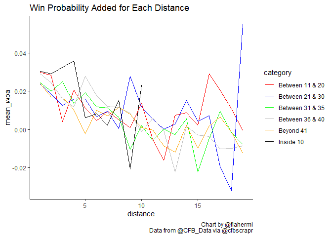

FG effect on Win Probability
================
Matthew Flaherty
December 30, 2020

# Introduction

A common theme among sports analytics is that kicking a field goal is
not always the best option. You can search the web and find graphs that
tell coaches to not kick the field goal if they are within a certain
yard line with a certain down and distance to go. Graphs similar to this
one: 
This post will delve into the win probability as affected by a field
goal. Specifically, this post will look at the win probability for a
team before and after kicking a field goal as compared to those teams
that attempted to get the first down on fourth down.

# Background

Win Probability Added (WPA) is the probability added to a team’s chance
of winning after a given play. This number can be negative for plays
like missed field goals or it can be positive for plays like touchdowns.
It is within the coach’s best interest to have WPA be a positive number
on as many plays as possible.

# Data

I will be using fourth down data from the 2014 season through the 2020
season. This data comes from the
[nflscrapR](https://github.com/ryurko/nflscrapR-data) GitHub page.

``` r
pbp <- data.frame()
seasons <- seq(2014,2020, by = 1)
pbp <- purrr::map_df(seasons, function(x) {
  readRDS(
    url(
      glue::glue("https://raw.githubusercontent.com/saiemgilani/cfbscrapR-data/master/data/rds/pbp_players_pos_{x}.rds")
    )
  )
})
```

# Methods

I will calculate the mean win probability added by attempting a field
goal and the mean win probability of attempting to get the first down on
fourth down. This will show which strategy increases the win probability
for a team on average. I will set up multiple scenarios because
different yardage can affect the win probability added and I want to
give an accurate report that coaches may be able to use during a game.

## Within 10 yards of the endzone

The first scenario is within 10 yards of the endzone.

``` r
within_10 = pbp %>%
  filter(down == 4 & yards_to_goal <= 10)
```

### Win probability added by a FG

``` r
fg_10 = within_10 %>%
  filter(play_type == 'Field Goal Missed' | play_type == 'Field Goal Good' | play_type == 'Blocked Field Goal' | play_type == 'Blocked Field Goal Touchdown' | play_type == 'Missed Field Goal Return' | play_type == 'Missed Field Goal Return Touchdown') %>%
  filter(!is.na(wpa)) %>%
  summarize(mean_wpa = mean(wpa))
```

Field goals on average increase the kicking teams chance of winning by
-0.52%.

### Scenarios where the offense goes for it

#### Within 3 yards to gain

``` r
not_fg_3_10 = within_10 %>%
  filter(rush == 1 | pass == 1) %>%
  filter(!is.na(wpa)) %>%
  filter(distance <= 3) %>%
  summarize(mean_wpa = mean(wpa))
```

On average, teams that elect to go for it will increase their win
probability added by 3%.

#### Between four and seven yards to gain

``` r
not_fg_4_7_10 = within_10 %>%
  filter(rush == 1 | pass == 1) %>%
  filter(!is.na(wpa)) %>%
  filter(distance >= 4 & distance <=7) %>%
  summarize(mean_wpa = mean(wpa))
```

Teams that elect to go for it between four and seven yards to gain the
first down will increase their win probability added by an average of
1.79%.

#### Beyond eight yards to gain

``` r
not_fg_8_10 = within_10 %>%
  filter(rush == 1 | pass == 1) %>%
  filter(!is.na(wpa)) %>%
  filter(distance >= 8) %>%
  summarize(mean_wpa = mean(wpa))
```

Teams that elect to go for it beyond eight yards to gain the first will
increase their win probability added by an average of 0.83%.

## Between 11 and 20 yards of the endzone

The second scenario I create is between 11 and 20 yards of the endzone.

``` r
bw_11_20 = pbp %>%
  filter(down == 4 & yards_to_goal >= 11 & yards_to_goal <= 20)
```

### Win probability added by a FG

``` r
fg_11_20 = bw_11_20 %>%
  filter(play_type == 'Field Goal Missed' | play_type == 'Field Goal Good' | play_type == 'Blocked Field Goal' | play_type == 'Blocked Field Goal Touchdown' | play_type == 'Missed Field Goal Return' | play_type == 'Missed Field Goal Return Touchdown') %>%
  filter(!is.na(wpa)) %>%
  summarize(mean_wpa = mean(wpa))
```

Field goals on average increase the kicking teams chance of winning by
0.06%.

### Scenarios where the offense goes for it

#### Within 3 yards to gain

``` r
not_fg_3_1120 = bw_11_20 %>%
  filter(rush == 1 | pass == 1) %>%
  filter(!is.na(wpa)) %>%
  filter(distance <= 3) %>%
  summarize(mean_wpa = mean(wpa))
```

On average, teams that elect to go for it will increase their win
probability added by 2.63%.

#### Between four and seven yards to gain

``` r
not_fg_4_7_1120 = bw_11_20 %>%
  filter(rush == 1 | pass == 1) %>%
  filter(!is.na(wpa)) %>%
  filter(distance >= 4 & distance <=7) %>%
  summarize(mean_wpa = mean(wpa))
```

Teams that elect to go for it between four and seven yards to gain the
first down will increase their win probability added by an average of
1.34%.

#### Beyond eight yards to gain

``` r
not_fg_8_1120 = bw_11_20 %>%
  filter(rush == 1 | pass == 1) %>%
  filter(!is.na(wpa)) %>%
  filter(distance >= 8) %>%
  summarize(mean_wpa = mean(wpa))
```

Teams that elect to go for it beyond eight yards to gain the first will
increase their win probability added by an average of 0.47%.

## Between 21 and 30 yards of the endzone

``` r
bw_21_30 = pbp %>%
  filter(down == 4 & yards_to_goal >= 21 & yards_to_goal <= 30)
```

### Win probability added by a FG

``` r
fg_2130 = bw_21_30 %>%
  filter(play_type == 'Field Goal Missed' | play_type == 'Field Goal Good' | play_type == 'Blocked Field Goal' | play_type == 'Blocked Field Goal Touchdown' | play_type == 'Missed Field Goal Return' | play_type == 'Missed Field Goal Return Touchdown') %>%
  filter(!is.na(wpa)) %>%
  summarize(mean_wpa = mean(wpa))
```

Field goals on average increase the kicking teams chance of winning by
0.82%.

### Scenarios where the offense goes for it

#### Within 3 yards to gain

``` r
not_fg_3_2130 = bw_21_30 %>%
  filter(rush == 1 | pass == 1) %>%
  filter(!is.na(wpa)) %>%
  filter(distance <= 3) %>%
  summarize(mean_wpa = mean(wpa))
```

On average, teams that elect to go for it will increase their win
probability added by 2.03%.

#### Between four and seven yards to gain

``` r
not_fg_4_7_2130 = bw_21_30 %>%
  filter(rush == 1 | pass == 1) %>%
  filter(!is.na(wpa)) %>%
  filter(distance >= 4 & distance <=7) %>%
  summarize(mean_wpa = mean(wpa))
```

Teams that elect to go for it between four and seven yards to gain the
first down will increase their win probability added by an average of
1.26%.

#### Beyond eight yards to gain

``` r
not_fg_8_2130 = bw_21_30 %>%
  filter(rush == 1 | pass == 1) %>%
  filter(!is.na(wpa)) %>%
  filter(distance >= 8) %>%
  summarize(mean_wpa = mean(wpa))
```

Teams that elect to go for it beyond eight yards to gain the first will
increase their win probability added by an average of 0.69%.

## Between 31 and 35 yards of the endzone

``` r
bw_31_35 = pbp %>%
  filter(down == 4 & yards_to_goal >= 31 & yards_to_goal <= 35)
```

### Win probability added by a FG

``` r
fg_3135 = bw_31_35 %>%
  filter(play_type == 'Field Goal Missed' | play_type == 'Field Goal Good' | play_type == 'Blocked Field Goal' | play_type == 'Blocked Field Goal Touchdown' | play_type == 'Missed Field Goal Return' | play_type == 'Missed Field Goal Return Touchdown') %>%
  filter(!is.na(wpa)) %>%
  summarize(mean_wpa = mean(wpa))
```

Field goals on average increase the kicking teams chance of winning by
1.4%.

### Scenarios where the offense goes for it

#### Within 3 yards to gain

``` r
not_fg_3_3135 = bw_31_35 %>%
  filter(rush == 1 | pass == 1) %>%
  filter(!is.na(wpa)) %>%
  filter(distance <= 3) %>%
  summarize(mean_wpa = mean(wpa))
```

On average, teams that elect to go for it will increase their win
probability added by 2.33%.

#### Between four and seven yards to gain

``` r
not_fg_4_7_3135 = bw_31_35 %>%
  filter(rush == 1 | pass == 1) %>%
  filter(!is.na(wpa)) %>%
  filter(distance >= 4 & distance <=7) %>%
  summarize(mean_wpa = mean(wpa))
```

Teams that elect to go for it between four and seven yards to gain the
first down will increase their win probability added by an average of
1.42%.

#### Beyond eight yards to gain

``` r
not_fg_8_3135 = bw_31_35 %>%
  filter(rush == 1 | pass == 1) %>%
  filter(!is.na(wpa)) %>%
  filter(distance >= 8) %>%
  summarize(mean_wpa = mean(wpa))
```

Teams that elect to go for it beyond eight yards to gain the first will
increase their win probability added by an average of -0.12%.

## Between 36 and 40 yards of the endzone

``` r
bw_36_40 = pbp %>%
  filter(down == 4 & yards_to_goal >= 36 & yards_to_goal <= 40)
```

### Win probability added by a FG

``` r
fg_3640 = bw_36_40 %>%
  filter(play_type == 'Field Goal Missed' | play_type == 'Field Goal Good' | play_type == 'Blocked Field Goal' | play_type == 'Blocked Field Goal Touchdown' | play_type == 'Missed Field Goal Return' | play_type == 'Missed Field Goal Return Touchdown') %>%
  filter(!is.na(wpa)) %>%
  summarize(mean_wpa = mean(wpa))
```

Field goals on average increase the kicking teams chance of winning by
1.52%.

### Scenarios where the offense goes for it

#### Within 3 yards to gain

``` r
not_fg_3_3640 = bw_36_40 %>%
  filter(rush == 1 | pass == 1) %>%
  filter(!is.na(wpa)) %>%
  filter(distance <= 3) %>%
  summarize(mean_wpa = mean(wpa))
```

On average, teams that elect to go for it will increase their win
probability added by 2.5%.

#### Between four and seven yards to gain

``` r
not_fg_4_7_3640 = bw_36_40 %>%
  filter(rush == 1 | pass == 1) %>%
  filter(!is.na(wpa)) %>%
  filter(distance >= 4 & distance <=7) %>%
  summarize(mean_wpa = mean(wpa))
```

Teams that elect to go for it between four and seven yards to gain the
first down will increase their win probability added by an average of
1.71%.

#### Beyond eight yards to gain

``` r
not_fg_8_3640 = bw_36_40 %>%
  filter(rush == 1 | pass == 1) %>%
  filter(!is.na(wpa)) %>%
  filter(distance >= 8) %>%
  summarize(mean_wpa = mean(wpa))
```

Teams that elect to go for it beyond eight yards to gain the first will
increase their win probability added by an average of 0.18%.

## Beyond 41 yards of the endzone

``` r
beyond_41 = pbp %>%
  filter(down == 4 & yards_to_goal > 41)
```

### Win probability added by a FG

``` r
fg_41 = beyond_41 %>%
  filter(play_type == 'Field Goal Missed' | play_type == 'Field Goal Good' | play_type == 'Blocked Field Goal' | play_type == 'Blocked Field Goal Touchdown' | play_type == 'Missed Field Goal Return' | play_type == 'Missed Field Goal Return Touchdown') %>%
  filter(!is.na(wpa)) %>%
  summarize(mean_wpa = mean(wpa))
```

Field goals on average increase the kicking teams chance of winning by
-1.26%.

### Scenarios where the offense goes for it

#### Within 3 yards to gain

``` r
not_fg_3_41 = beyond_41 %>%
  filter(rush == 1 | pass == 1) %>%
  filter(!is.na(wpa)) %>%
  filter(distance <= 3) %>%
  summarize(mean_wpa = mean(wpa))
```

On average, teams that elect to go for it will increase their win
probability added by 2.15%.

#### Between four and seven yards to gain

``` r
not_fg_4_7_41 = beyond_41 %>%
  filter(rush == 1 | pass == 1) %>%
  filter(!is.na(wpa)) %>%
  filter(distance >= 4 & distance <=7) %>%
  summarize(mean_wpa = mean(wpa))
```

Teams that elect to go for it between four and seven yards to gain the
first down will increase their win probability added by an average of
0.58%.

#### Beyond eight yards to gain

``` r
not_fg_8_41 = beyond_41 %>%
  filter(rush == 1 | pass == 1) %>%
  filter(!is.na(wpa)) %>%
  filter(distance >= 8) %>%
  summarize(mean_wpa = mean(wpa))
```

Teams that elect to go for it beyond eight yards to gain the first will
increase their win probability added by an average of 0.07%.

# Results

This table includes all of the calculations. Coaches should realize the
distance they have remaining to the endzone and use the average win
probability added in that section for advice on whether to go for it or
kick a field goal

| Distance to Endzone | Distance to Firstdown |   FG    | Go for it |
| :-----------------: | :-------------------: | :-----: | :-------: |
|    Within 10 yds    |      3 yds to go      | \-0.52% |    3%     |
|                     |     Between 4 & 7     |         |   1.79%   |
|                     |       Beyond 8        |         |   0.83%   |
| Between 11 & 20 yds |      3 yds to go      |  0.06%  |   2.63%   |
|                     |     Between 4 & 7     |         |   1.34%   |
|                     |       Beyond 8        |         |   0.47%   |
| Between 21 & 30 yds |      3 yds to go      |  0.82%  |   2.03%   |
|                     |     Between 4 & 7     |         |   1.26%   |
|                     |       Beyond 8        |         |   0.69%   |
| Between 31 & 35 yds |      3 yds to go      |  1.4%   |   2.33%   |
|                     |     Between 4 & 7     |         |   1.42%   |
|                     |       Beyond 8        |         |  \-0.12%  |
| Between 36 & 40 yds |      3 yds to go      |  1.52%  |   2.5%    |
|                     |     Between 4 & 7     |         |   1.71%   |
|                     |       Beyond 8        |         |   0.18%   |
|    Beyond 41 yds    |      3 yds to go      | \-1.26% |   2.15%   |
|                     |     Between 4 & 7     |         |   0.58%   |
|                     |       Beyond 8        |         |   0.07%   |

The results show that coaches should always go for it inside the
redzone, barring any improbable distance to the first down line. Between
21 and 30 yards, coaches should consider going for it if they are within
seven yards of the first down line but kick the field goal beyond 8
yards to the first down line. Between 31 and 35 yards to the endzone
only proves beneficial to go for it when the distance is less than 3
yards to gain the first down. Between 4 and 7 yards to gain provides no
economically significan difference between the average win probabilities
added and going for it beyond 8 yards in this bracket decreases the win
probability added. Between 36 and 40 yards to the endzone provides
similar results while anything beyond 41 yards suggests going for it to
be the best option.

## Plot of the results

I will graph the results to see if it produces something similar to the
figure at the beginning of the post.

``` r
down4 = pbp %>%
  filter(down == 4)

inside_10 = down4 %>%
  filter(yards_to_goal <= 10) %>%
  filter(distance > 0 & distance < 20) %>%
  filter(rush == 1 | pass == 1) %>%
  group_by(distance)%>%
  summarize(mean_wpa = mean(wpa, na.rm = TRUE)) %>%
  mutate(category = 'Inside 10')
```

    ## `summarise()` ungrouping output (override with `.groups` argument)

``` r
between_11_20 = down4 %>%
  filter(yards_to_goal >= 11 & yards_to_goal <= 20) %>%
  filter(distance > 0 & distance < 20) %>%
  filter(rush == 1 | pass == 1) %>%
  group_by(distance)%>%
  summarize(mean_wpa = mean(wpa, na.rm = TRUE)) %>%
  mutate(category = 'Between 11 & 20')
```

    ## `summarise()` ungrouping output (override with `.groups` argument)

``` r
between_21_30 = down4 %>%
  filter(yards_to_goal >= 21 & yards_to_goal <= 30) %>%
  filter(distance > 0 & distance < 20) %>%
  filter(rush == 1 | pass == 1) %>%
  group_by(distance)%>%
  summarize(mean_wpa = mean(wpa, na.rm = TRUE)) %>%
  mutate(category = 'Between 21 & 30')
```

    ## `summarise()` ungrouping output (override with `.groups` argument)

``` r
between_31_35 = down4 %>%
  filter(yards_to_goal >= 31 & yards_to_goal <= 35) %>%
  filter(distance > 0 & distance < 20) %>%
  filter(rush == 1 | pass == 1) %>%
  group_by(distance)%>%
  summarize(mean_wpa = mean(wpa, na.rm = TRUE)) %>%
  mutate(category = 'Between 31 & 35')
```

    ## `summarise()` ungrouping output (override with `.groups` argument)

``` r
between_36_40 = down4 %>%
  filter(yards_to_goal >= 36 & yards_to_goal <= 40) %>%
  filter(distance > 0 & distance < 20) %>%
  filter(rush == 1 | pass == 1) %>%
  group_by(distance)%>%
  summarize(mean_wpa = mean(wpa, na.rm = TRUE)) %>%
  mutate(category = 'Between 36 & 40')
```

    ## `summarise()` ungrouping output (override with `.groups` argument)

``` r
beyond_41yds = down4 %>%
  filter(yards_to_goal >= 41) %>%
  filter(distance > 0 & distance < 20) %>%
  filter(rush == 1 | pass == 1) %>%
  group_by(distance)%>%
  summarize(mean_wpa = mean(wpa, na.rm = TRUE)) %>%
  mutate(category = 'Beyond 41')
```

    ## `summarise()` ungrouping output (override with `.groups` argument)

``` r
newdf = rbind(inside_10, between_11_20)
newdf = rbind(newdf, between_21_30)
newdf = rbind(newdf, between_31_35)
newdf = rbind(newdf, between_36_40)
newdf = rbind(newdf, beyond_41yds)

ggplot(newdf, aes(distance, mean_wpa, color = category)) +
  geom_line() +
  scale_colour_manual(values = c('red', 'blue', 'green','grey', 'orange', 'black')) +
  theme_classic()+
  labs(title = 'Win Probability Added for Each Distance',
       caption = paste0("Chart by @flahermi\nData from @CFB_Data via @cfbscrapr"))
```

<!-- -->

The Graph is uninterpretable.

# Conlcusion

This post attempted to provide suggestions to coaches on when to go for
it and when to kick the field goal. Coaches should always go for it
within 3 yards to gain the first down. These suggestions should be taken
with respect to each team. If the offense has a low probability of
getting the first down, then they might consider kicking the field goal.
