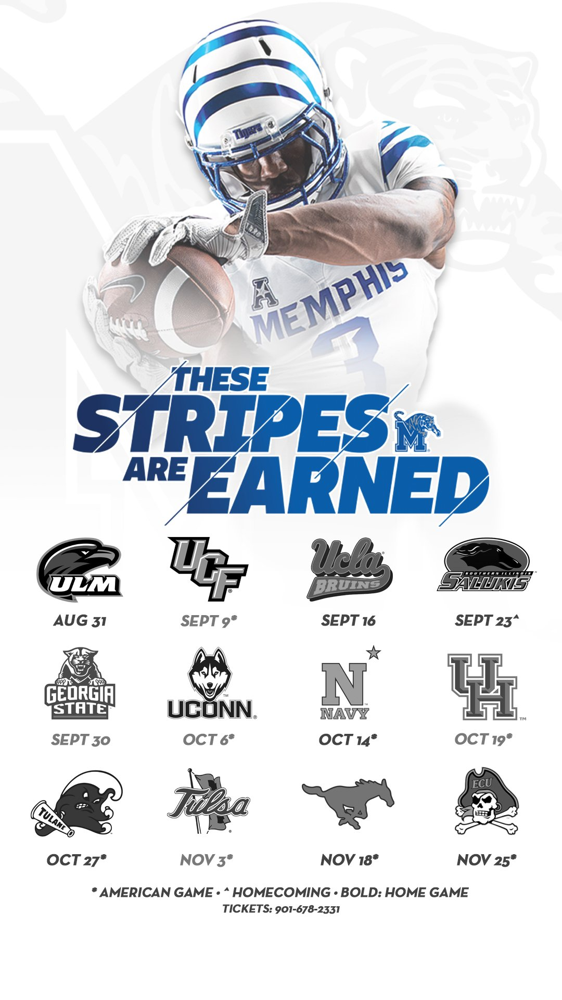
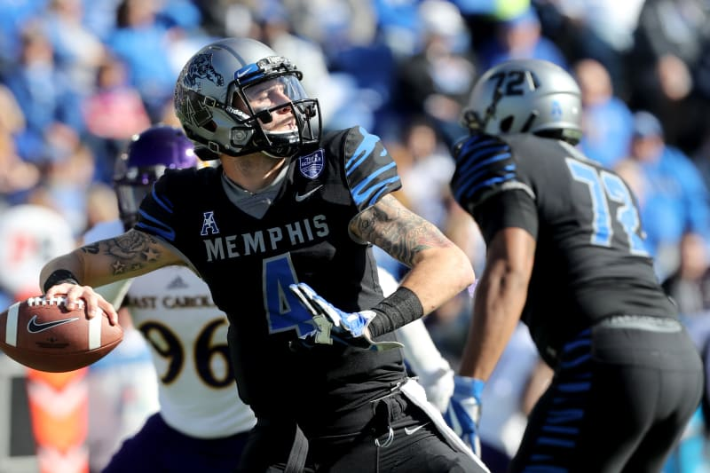
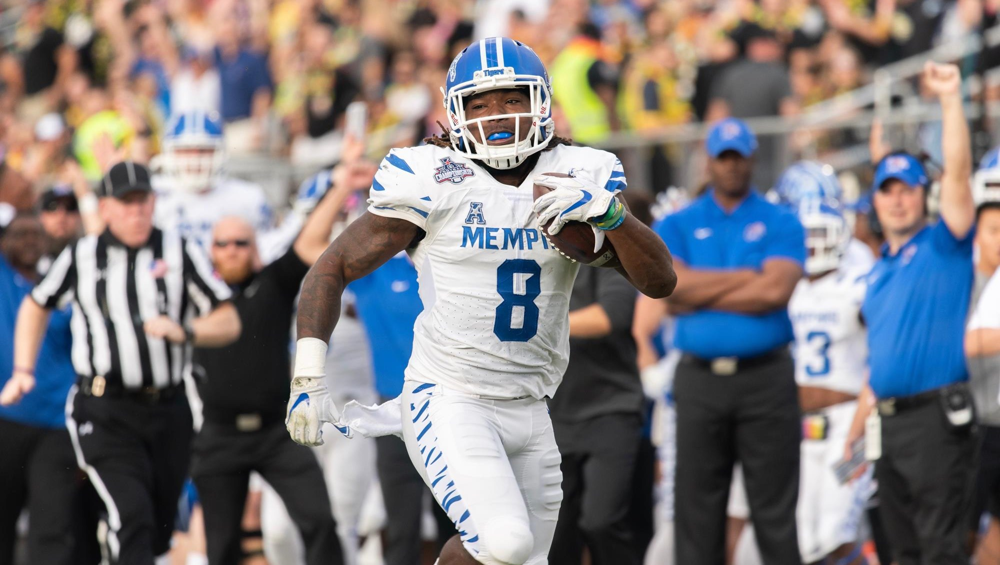
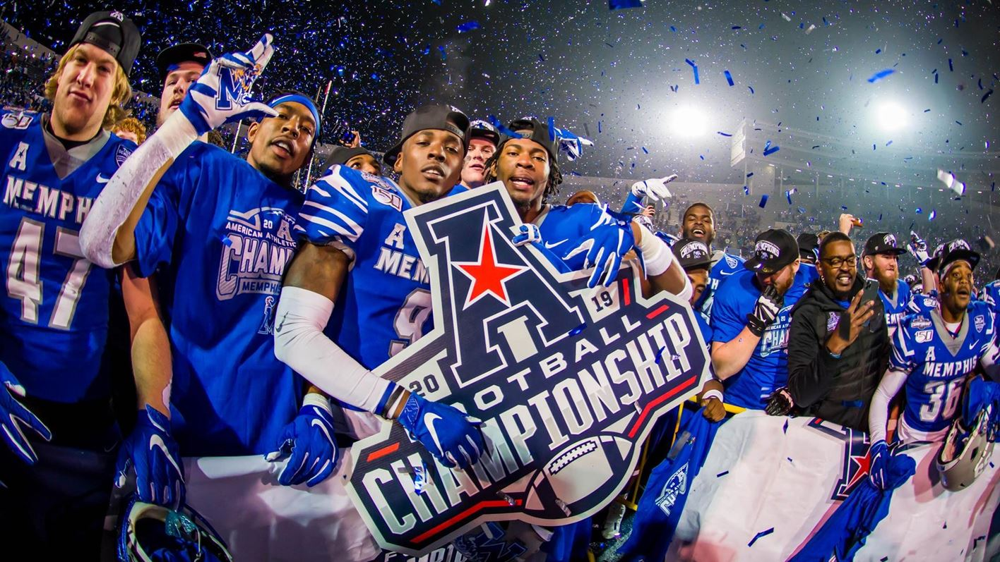

```{r global options, include = FALSE}
knitr::opts_chunk$set(echo=TRUE, warning=FALSE, message=FALSE)
```


# Introduction

The 2020 football season was a season unlike any other. It felt let nothing was guaranteed as players opted out through the season and games had to be postponed or cancelled due to COVID protocols. Nevertheless, the college football season ended with a national championship game and a decent amount of bowl games played. A success as far as games played are concerned.

In this post, I want to take a look back at the 2020 season for the Memphis Tigers. Memphis finished the regular season at 7-3 and won the Montgomery Bowl against Florida Atlantic University. Coach Ryan Silverfield completed his first season as head coach and Brady White capped of an amazing career as a Memphis Tiger.

```{r libraries}
library(tidyverse)
library(cfbscrapR)
```

```{r data}
pbp <- data.frame()
seasons <- seq(2014,2020, by = 1)
pbp <- purrr::map_df(seasons, function(x) {
  readRDS(
    url(
      glue::glue("https://raw.githubusercontent.com/saiemgilani/cfbscrapR-data/master/data/rds/pbp_players_pos_{x}.rds")
    )
  )
})

```

# Memphis Offense

After a superb 2019 season that resulted in a trip to the Cotton Bowl, the Memphis offense looked to continue its success as it returned three of the best offensive weapons from the 2019 offense: Kenneth Gainwell, Damonte Coxie, and Brady White. As I said earlier, this was a season unlike any other and as such, the Memphis offense faced adversity right out of the gates as Gainwell opted out of the season. Additional adversity hit as Coxie opted out after the second game of the season. Regardless, Memphis adapted and continued to show why they are deserving of the name "Athlete U" as the young talent that filled the void of Gainwell and Coxie gave hope that this season would not be as bad as expected and gave hope that this young talent would continue to wow the fans in years to come. 

```{r data_mem_off}
mem_off <- pbp %>%
  filter(year == 2020) %>%
  filter(pos_team == "Memphis") %>%
  filter(pass == 1 | rush == 1)
```

```{r include=FALSE}
colnames(mem_off)
```

## EPA/play

Expected Points Added (EPA) is the statistic that values an individual play in terms of points. This statistic is beneficial as a performance measurement because yardage gained per play can have different values given a scenario. For example, a three yerd gain on 3rd and 15 is not as significant as a three yard gain on 3rd and 2.

```{r}
get_szn <- function(data, year_szn , team_want){
  data %>%
  filter(year == year_szn) %>%
  filter(pass == 1 | rush == 1) %>%
  group_by(offense_play, offense_conference) %>%
  summarise(epa_play = mean(EPA, na.rm = TRUE)) %>%
  arrange(desc(epa_play)) %>%
  rename(team = offense_play) %>%
  ungroup() %>%
  mutate(rank = row_number()) %>%
  filter(team == team_want)
}

mem_2020 <- get_szn(pbp, year_szn = 2020, team_want = "Memphis")
mem_2019 <- get_szn(pbp, year_szn = 2019, team_want = "Memphis")
mem_2018 <- get_szn(pbp, year_szn = 2018, team_want = "Memphis")
mem_2017 <- get_szn(pbp, year_szn = 2017, team_want = "Memphis")
mem_2016 <- get_szn(pbp, year_szn = 2016, team_want = "Memphis")
mem_2015 <- get_szn(pbp, year_szn = 2015, team_want = "Memphis")
mem_2014 <- get_szn(pbp, year_szn = 2014, team_want = "Memphis")

best_mem_off <- do.call("rbind", list(mem_2020, mem_2019, mem_2018, mem_2017, mem_2016, mem_2015, mem_2014)) %>%
  arrange(desc(epa_play))

mem_2014_2020_epa <- pbp %>%
  filter(offense_play == 'Memphis') %>%
  filter(rush == 1 | pass == 1) %>% 
  group_by(offense_play, year, offense_conference) %>%
  summarize(off_epa = mean(EPA, na.rm = TRUE)) %>%
  arrange(desc(off_epa)) %>%
  mutate(Team = paste0(offense_play, year)) %>%
  ungroup() %>%
  mutate(Rank = row_number()) %>%
  select(Team, everything(), -offense_play)

```

The Memphis offense had an average EPA/play of `r round(mem_2020$epa_play,3)`, this earned them a rank of `r mem_2020$rank`. This was their second worst EPA/play since 2014 where the Memphis offense had an EPA/play of `r round(best_mem_off$epa_play[7],3)` which ranked `r best_mem_off$rank[7]` in the NCAA that year. The best Memphis offense ranked by EPA/play since 2014 was the 2017 offense which had an EPA/play of `r round(best_mem_off$epa_play[1],3)` and ranked `r best_mem_off$rank[1]` in the NCAA that year. 



### Pass EPA/play 

```{r}
get_pass_szn <- function(data, year_szn , team_want){
  data %>%
  filter(year == year_szn) %>%
  filter(pass == 1) %>%
  group_by(offense_play, offense_conference) %>%
  summarise(epa_play = mean(EPA, na.rm = TRUE)) %>%
  arrange(desc(epa_play)) %>%
  rename(team = offense_play) %>%
  ungroup() %>%
  mutate(rank = row_number()) %>%
  filter(team == team_want)
}

mem_pass_2020 <- get_pass_szn(pbp, year_szn = 2020, team_want = "Memphis")
mem_pass_2019 <- get_pass_szn(pbp, year_szn = 2019, team_want = "Memphis")
mem_pass_2018 <- get_pass_szn(pbp, year_szn = 2018, team_want = "Memphis")
mem_pass_2017 <- get_pass_szn(pbp, year_szn = 2017, team_want = "Memphis")
mem_pass_2016 <- get_pass_szn(pbp, year_szn = 2016, team_want = "Memphis")
mem_pass_2015 <- get_pass_szn(pbp, year_szn = 2015, team_want = "Memphis")
mem_pass_2014 <- get_pass_szn(pbp, year_szn = 2014, team_want = "Memphis")

mem_2014_2020_pass <- pbp %>%
  filter(offense_play == 'Memphis') %>%
  filter(pass == 1) %>% 
  group_by(year, offense_conference) %>%
  summarize(off_epa = mean(EPA, na.rm = TRUE)) %>%
  arrange(desc(off_epa)) %>%
  mutate(Team = paste0("Memphis", year)) %>%
  ungroup() %>%
  mutate(Rank = row_number()) %>%
  select(Team, everything())
```

The Memphis offense had an average EPA/pass of `r round(mem_pass_2020$epa_play,3)` which ranked `r mem_pass_2020$rank`. This was also the second worse EPA/play since 2014 where the offense had an EPA/pass of `r round(mem_2014_2020_pass$off_epa[7],3)` which ranked `r mem_pass_2014$rank`. The best Memphis offense for EPA/pass since 2014 was once again the 2017 offense which had an EPA/pass of `r round(mem_pass_2017$epa_play,3)` and ranked `r mem_pass_2017$rank` in the NCAA for EPA/pass.



### Rush EPA/play

```{r}
get_rush_szn <- function(data, year_szn , team_want){
  data %>%
  filter(year == year_szn) %>%
  filter(rush == 1) %>%
  group_by(offense_play, offense_conference) %>%
  summarise(epa_play = mean(EPA, na.rm = TRUE)) %>%
  arrange(desc(epa_play)) %>%
  rename(team = offense_play) %>%
  ungroup() %>%
  mutate(rank = row_number()) %>%
  filter(team == team_want)
}

mem_rush_2020 <- get_rush_szn(pbp, year_szn = 2020, team_want = "Memphis")
mem_rush_2019 <- get_rush_szn(pbp, year_szn = 2019, team_want = "Memphis")
mem_rush_2018 <- get_rush_szn(pbp, year_szn = 2018, team_want = "Memphis")
mem_rush_2017 <- get_rush_szn(pbp, year_szn = 2017, team_want = "Memphis")
mem_rush_2016 <- get_rush_szn(pbp, year_szn = 2016, team_want = "Memphis")
mem_rush_2015 <- get_rush_szn(pbp, year_szn = 2015, team_want = "Memphis")
mem_rush_2014 <- get_rush_szn(pbp, year_szn = 2014, team_want = "Memphis")

mem_2014_2020_rush <- pbp %>%
  filter(offense_play == 'Memphis') %>%
  filter(rush == 1) %>% 
  group_by(year, offense_conference) %>%
  summarize(off_epa = mean(EPA, na.rm = TRUE)) %>%
  arrange(desc(off_epa)) %>%
  mutate(Team = paste0("Memphis", year)) %>%
  ungroup() %>%
  mutate(Rank = row_number()) %>%
  select(Team, everything())

ncaa_pass <- pbp %>%
  filter(pass == 1)

ncaa_run <- pbp %>%
  filter(rush == 1)
```

The offense had an EPA/rush of `r round(mem_rush_2020$epa_play,3)` which ranked `r mem_rush_2020$rank` in the NCAA. This was something that seemed prevalent as the season progressed as at certain times in games, it felt like Memphis had to rely on passing because they could not run the ball. This was the worst EPA/rush that Memphis had since 2014 in which they had an EPA/rush of `r round(mem_rush_2014$epa_play,3)` and ranked `r mem_rush_2014$rank` in the NCAA. The best season that Memphis had rushing the ball was in 2018 when they had an EPA/rush of `r round(mem_rush_2018$epa_play,3)` and ranked `r mem_rush_2018$rank`.



One thing that is interesting is that EPA/rush almost never outperforms EPA/pass. For example, in 2018 when Memphis had its highest EPA/rush at `r round(mem_rush_2018$epa_play,3)`, it still did not fair better than its EPA/pass at `r round(mem_pass_2018$epa_play,3)`. Also, since 2014 the average EPA/pass has been `r round(mean(ncaa_pass$EPA, na.rm = TRUE),3)` and average EPA/rush has been `r round(mean(ncaa_run$EPA, na.rm = TRUE),3)` in the NCAA. This could imply that teams should pass more, but it also could imply that the run allows offenses to have success passing the ball. 

### Early Down Situations (1st & 2nd down)

Something that is interesting to look at is how teams EPA/pass and EPA/rush differ on early downs (1st & 2nd down). This could offer advice on what teams should do on early downs.

```{r}
mem_pass_early <- mem_off %>%
  filter(down == 1 | down == 2) %>%
  filter(pass == 1)

mem_run_early <- mem_off %>%
  filter(down == 1 | down == 2) %>%
  filter(rush == 1) 
```

Memphis' EPA/pass on early downs was `r round(mean(mem_pass_early$EPA),3)` and its EPA/rush on early downs was `r round(mean(mem_run_early$EPA),3)`. This suggests that Memphis performed better on early downs when they threw the football. This would make sense because an old tale in football is that you need to run it on early downs so the defenses adjust to this by having more players in the box.

Memphis had a pretty even distribution of rushes and passes on early downs. They had `r (length(mem_pass_early$EPA)+length(mem_run_early$EPA))` plays on early downs and passed the ball `r length(mem_pass_early$EPA)` times (`r paste0(round((length(mem_pass_early$EPA)/(length(mem_pass_early$EPA)+length(mem_run_early$EPA))*100),2), "%")`). With better success passing on early downs, it would be nice to see the offense increase its passing percentage on early downs in 2021.

## Win Probability added on 4th down

The goal of the offense should not be to maximize the points on the scoreboard, but to maximize the win probability. 4th down is a down where coaches should take advantage of maximizing the win probability because kicking the field goal is not always the best option for the team as far as win probability goes. Punting to pin the other team deep also may not be the best strategy for maximizing win probability. I will look at how Memphis did on 4th down for win probability.

```{r}
special_teams <- function(data, year_szn , team_want){
  data %>%
  filter(year == year_szn) %>%
  filter(down == 4) %>%
  group_by(offense_play, offense_conference) %>%
  summarise(avg_wpa = mean(wpa, na.rm = TRUE)) %>%
  arrange(desc(avg_wpa)) %>%
  rename(team = offense_play) %>%
  ungroup() %>%
  mutate(rank = row_number()) %>%
  filter(team == team_want)
}

mem_st_2020 <- special_teams(pbp, year_szn = 2020, team_want = "Memphis")
mem_st_2019 <- special_teams(pbp, year_szn = 2019, team_want = "Memphis")
mem_st_2018 <- special_teams(pbp, year_szn = 2018, team_want = "Memphis")
mem_st_2017 <- special_teams(pbp, year_szn = 2017, team_want = "Memphis")
mem_st_2016 <- special_teams(pbp, year_szn = 2016, team_want = "Memphis")
mem_st_2015 <- special_teams(pbp, year_szn = 2015, team_want = "Memphis")
mem_st_2014 <- special_teams(pbp, year_szn = 2014, team_want = "Memphis")

mem_2014_2020_st <- pbp %>%
  filter(offense_play == 'Memphis') %>%
  filter(down == 4) %>% 
  group_by(year, offense_conference) %>%
  summarize(avg_wpa = mean(wpa, na.rm = TRUE)) %>%
  arrange(desc(avg_wpa)) %>%
  mutate(Team = paste0("Memphis", year)) %>%
  ungroup() %>%
  mutate(Rank = row_number()) %>%
  select(Team, everything())
```

On 4th downs, Memphis' average win probability added was `r round(mem_st_2020$avg_wpa,3)` which ranked `r mem_st_2020$rank` in the NCAA. This is good news for Memphis fans because it shows that Coach Silverfield is not willing to be conservative and will attempt to put his teams into situations where they have a better chance to win games. This was the second most aggressive team that Memphis has had since 2014 with the only more aggressive team being the 2019 Memphis Tigers that won the conference title and earned a trip to the Cotton Bowl. That team had an average win probability added on 4th down of `r round(mem_st_2019$avg_wpa,3)` which ranked `r mem_st_2019$rank` in the NCAA.



# Memphis Defense

```{r wpa_conf, include=FALSE}
library(gt)
pbp %>%
  filter(year == 2020) %>%
  filter(down == 4) %>% 
  group_by(offense_conference) %>%
  summarize(avg_wpa = round(mean(wpa, na.rm = TRUE),3)) %>%
  arrange(desc(avg_wpa)) %>%
  rename(Conference = offense_conference) %>%
  rename("Average Win Probability Added" = avg_wpa) %>%
  ungroup() %>%
  mutate(Rank = row_number()) %>%
  select(Rank, everything()) %>%
  gt() %>%
  tab_header(
    title = "Win Probability Added",
    subtitle = "Conference Ranking for Average Win Probability Added on 4th Down"
  )
```

