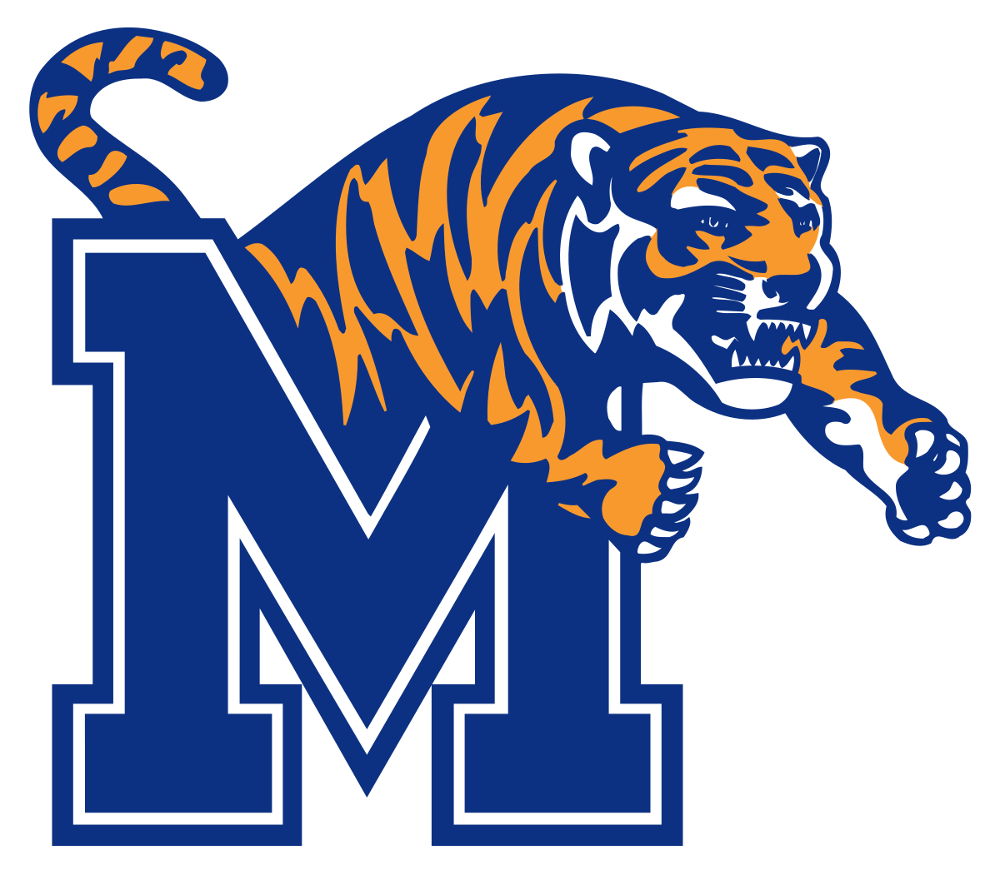
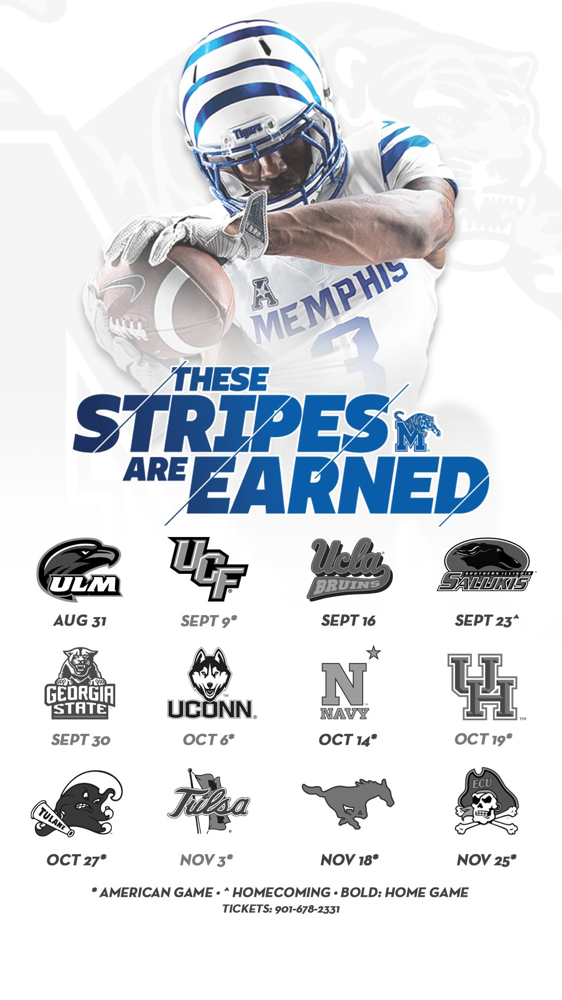
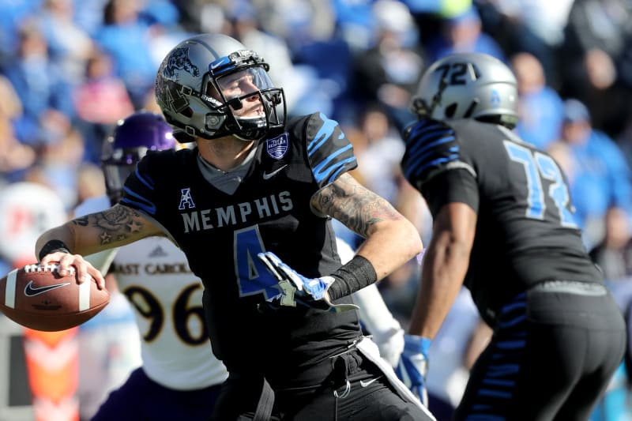
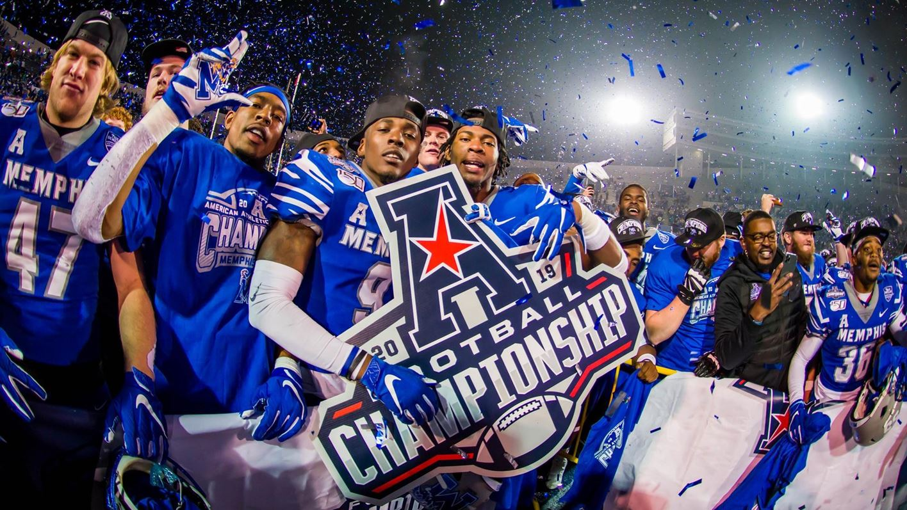

Memphis Tigers 2020 Season Recap
================
Matthew Flaherty
January 12, 2021



# Introduction

The 2020 football season was a season unlike any other. It felt let
nothing was guaranteed as players opted out through the season and games
had to be postponed or cancelled due to COVID protocols. Nevertheless,
the college football season ended with a national championship game and
a decent amount of bowl games played. A success as far as games played
are concerned.

In this post, I want to take a look back at the 2020 season for the
Memphis Tigers. Memphis finished the regular season at 7-3 and won the
Montgomery Bowl against Florida Atlantic University. Coach Ryan
Silverfield completed his first season as head coach and Brady White
capped of an amazing career as a Memphis Tiger.

``` r
library(tidyverse)
library(cfbscrapR)
```

``` r
pbp <- data.frame()
seasons <- seq(2014,2020, by = 1)
pbp <- purrr::map_df(seasons, function(x) {
  readRDS(
    url(
      glue::glue("https://raw.githubusercontent.com/saiemgilani/cfbscrapR-data/master/data/rds/pbp_players_pos_{x}.rds")
    )
  )
})
```

# Memphis Offense

After a superb 2019 season that resulted in a trip to the Cotton Bowl,
the Memphis offense looked to continue its success as it returned three
of the best offensive weapons from the 2019 offense: Kenneth Gainwell,
Damonte Coxie, and Brady White. As I said earlier, this was a season
unlike any other and as such, the Memphis offense faced adversity right
out of the gates as Gainwell opted out of the season. Additional
adversity hit as Coxie opted out after the second game of the season.
Regardless, Memphis adapted and continued to show why they are deserving
of the name “Athlete U” as the young talent that filled the void of
Gainwell and Coxie gave hope that this season would not be as bad as
expected and gave hope that this young talent would continue to wow the
fans in years to come.

``` r
mem_off <- pbp %>%
  filter(year == 2020) %>%
  filter(pos_team == "Memphis") %>%
  filter(pass == 1 | rush == 1)
```

## EPA/play

Expected Points Added (EPA) is the statistic that values an individual
play in terms of points. This statistic is beneficial as a performance
measurement because yardage gained per play can have different values
given a scenario. For example, a three yerd gain on 3rd and 15 is not as
significant as a three yard gain on 3rd and 2.

``` r
get_szn <- function(data, year_szn , team_want){
  data %>%
  filter(year == year_szn) %>%
  filter(pass == 1 | rush == 1) %>%
  group_by(offense_play, offense_conference) %>%
  summarise(epa_play = mean(EPA, na.rm = TRUE)) %>%
  arrange(desc(epa_play)) %>%
  rename(team = offense_play) %>%
  ungroup() %>%
  mutate(rank = row_number()) %>%
  filter(team == team_want)
}

mem_2020 <- get_szn(pbp, year_szn = 2020, team_want = "Memphis")
mem_2019 <- get_szn(pbp, year_szn = 2019, team_want = "Memphis")
mem_2018 <- get_szn(pbp, year_szn = 2018, team_want = "Memphis")
mem_2017 <- get_szn(pbp, year_szn = 2017, team_want = "Memphis")
mem_2016 <- get_szn(pbp, year_szn = 2016, team_want = "Memphis")
mem_2015 <- get_szn(pbp, year_szn = 2015, team_want = "Memphis")
mem_2014 <- get_szn(pbp, year_szn = 2014, team_want = "Memphis")

best_mem_off <- do.call("rbind", list(mem_2020, mem_2019, mem_2018, mem_2017, mem_2016, mem_2015, mem_2014)) %>%
  arrange(desc(epa_play))

mem_2014_2020_epa <- pbp %>%
  filter(offense_play == 'Memphis') %>%
  filter(rush == 1 | pass == 1) %>% 
  group_by(offense_play, year, offense_conference) %>%
  summarize(off_epa = mean(EPA, na.rm = TRUE)) %>%
  arrange(desc(off_epa)) %>%
  mutate(Team = paste0(offense_play, year)) %>%
  ungroup() %>%
  mutate(Rank = row_number()) %>%
  select(Team, everything(), -offense_play)
```

The Memphis offense had an average EPA/play of 0.028, this earned them a
rank of 65. This was their second worst EPA/play since 2014 where the
Memphis offense had an EPA/play of -0.053 which ranked 104 in the NCAA
that year. The best Memphis offense ranked by EPA/play since 2014 was
the 2017 offense which had an EPA/play of 0.196 and ranked 5 in the NCAA
that year.



### Pass EPA/play

``` r
get_pass_szn <- function(data, year_szn , team_want){
  data %>%
  filter(year == year_szn) %>%
  filter(pass == 1) %>%
  group_by(offense_play, offense_conference) %>%
  summarise(epa_play = mean(EPA, na.rm = TRUE)) %>%
  arrange(desc(epa_play)) %>%
  rename(team = offense_play) %>%
  ungroup() %>%
  mutate(rank = row_number()) %>%
  filter(team == team_want)
}

mem_pass_2020 <- get_pass_szn(pbp, year_szn = 2020, team_want = "Memphis")
mem_pass_2019 <- get_pass_szn(pbp, year_szn = 2019, team_want = "Memphis")
mem_pass_2018 <- get_pass_szn(pbp, year_szn = 2018, team_want = "Memphis")
mem_pass_2017 <- get_pass_szn(pbp, year_szn = 2017, team_want = "Memphis")
mem_pass_2016 <- get_pass_szn(pbp, year_szn = 2016, team_want = "Memphis")
mem_pass_2015 <- get_pass_szn(pbp, year_szn = 2015, team_want = "Memphis")
mem_pass_2014 <- get_pass_szn(pbp, year_szn = 2014, team_want = "Memphis")

mem_2014_2020_pass <- pbp %>%
  filter(offense_play == 'Memphis') %>%
  filter(pass == 1) %>% 
  group_by(year, offense_conference) %>%
  summarize(off_epa = mean(EPA, na.rm = TRUE)) %>%
  arrange(desc(off_epa)) %>%
  mutate(Team = paste0("Memphis", year)) %>%
  ungroup() %>%
  mutate(Rank = row_number()) %>%
  select(Team, everything())
```

The Memphis offense had an average EPA/pass of 0.13 which ranked 43.
This was also the second worse EPA/play since 2014 where the offense had
an EPA/pass of -0.009 which ranked 83. The best Memphis offense for
EPA/pass since 2014 was once again the 2017 offense which had an
EPA/pass of 0.265 and ranked 10 in the NCAA for EPA/pass.



### Rush EPA/play

``` r
get_rush_szn <- function(data, year_szn , team_want){
  data %>%
  filter(year == year_szn) %>%
  filter(rush == 1) %>%
  group_by(offense_play, offense_conference) %>%
  summarise(epa_play = mean(EPA, na.rm = TRUE)) %>%
  arrange(desc(epa_play)) %>%
  rename(team = offense_play) %>%
  ungroup() %>%
  mutate(rank = row_number()) %>%
  filter(team == team_want)
}

mem_rush_2020 <- get_rush_szn(pbp, year_szn = 2020, team_want = "Memphis")
mem_rush_2019 <- get_rush_szn(pbp, year_szn = 2019, team_want = "Memphis")
mem_rush_2018 <- get_rush_szn(pbp, year_szn = 2018, team_want = "Memphis")
mem_rush_2017 <- get_rush_szn(pbp, year_szn = 2017, team_want = "Memphis")
mem_rush_2016 <- get_rush_szn(pbp, year_szn = 2016, team_want = "Memphis")
mem_rush_2015 <- get_rush_szn(pbp, year_szn = 2015, team_want = "Memphis")
mem_rush_2014 <- get_rush_szn(pbp, year_szn = 2014, team_want = "Memphis")

mem_2014_2020_rush <- pbp %>%
  filter(offense_play == 'Memphis') %>%
  filter(rush == 1) %>% 
  group_by(year, offense_conference) %>%
  summarize(off_epa = mean(EPA, na.rm = TRUE)) %>%
  arrange(desc(off_epa)) %>%
  mutate(Team = paste0("Memphis", year)) %>%
  ungroup() %>%
  mutate(Rank = row_number()) %>%
  select(Team, everything())

ncaa_pass <- pbp %>%
  filter(pass == 1)

ncaa_run <- pbp %>%
  filter(rush == 1)
```

The offense had an EPA/rush of -0.091 which ranked 101 in the NCAA. This
was something that seemed prevalent as the season progressed as at
certain times in games, it felt like Memphis had to rely on passing
because they could not run the ball. This was the worst EPA/rush that
Memphis had since 2014 in which they had an EPA/rush of -0.085 and
ranked 122 in the NCAA. The best season that Memphis had rushing the
ball was in 2018 when they had an EPA/rush of 0.149 and ranked 17.


One thing that is interesting is that EPA/rush almost never outperforms
EPA/pass. For example, in 2018 when Memphis had its highest EPA/rush at
0.149, it still did not fair better than its EPA/pass at 0.153. Also,
since 2014 the average EPA/pass has been 0.003 and average EPA/rush has
been -0.009 in the NCAA. This could imply that teams should pass more,
but it also could imply that the run allows offenses to have success
passing the ball.

### Early Down Situations (1st & 2nd down)

Something that is interesting to look at is how teams EPA/pass and
EPA/rush differ on early downs (1st & 2nd down). This could offer advice
on what teams should do on early downs.

``` r
mem_pass_early <- mem_off %>%
  filter(down == 1 | down == 2) %>%
  filter(pass == 1)

mem_run_early <- mem_off %>%
  filter(down == 1 | down == 2) %>%
  filter(rush == 1) 
```

Memphis’ EPA/pass on early downs was 0.066 and its EPA/rush on early
downs was -0.161. This suggests that Memphis performed better on early
downs when they threw the football. This would make sense because an old
tale in football is that you need to run it on early downs so the
defenses adjust to this by having more players in the box.

Memphis had a pretty even distribution of rushes and passes on early
downs. They had 619 plays on early downs and passed the ball 304 times
(49.11%). With better success passing on early downs, it would be nice
to see the offense increase its passing percentage on early downs in
2021.

## Win Probability added on 4th down

The goal of the offense should not be to maximize the points on the
scoreboard, but to maximize the win probability. 4th down is a down
where coaches should take advantage of maximizing the win probability
because kicking the field goal is not always the best option for the
team as far as win probability goes. Punting to pin the other team deep
also may not be the best strategy for maximizing win probability. I will
look at how Memphis did on 4th down for win probability.

``` r
special_teams <- function(data, year_szn , team_want){
  data %>%
  filter(year == year_szn) %>%
  filter(down == 4) %>%
  group_by(offense_play, offense_conference) %>%
  summarise(avg_wpa = mean(wpa, na.rm = TRUE)) %>%
  arrange(desc(avg_wpa)) %>%
  rename(team = offense_play) %>%
  ungroup() %>%
  mutate(rank = row_number()) %>%
  filter(team == team_want)
}

mem_st_2020 <- special_teams(pbp, year_szn = 2020, team_want = "Memphis")
mem_st_2019 <- special_teams(pbp, year_szn = 2019, team_want = "Memphis")
mem_st_2018 <- special_teams(pbp, year_szn = 2018, team_want = "Memphis")
mem_st_2017 <- special_teams(pbp, year_szn = 2017, team_want = "Memphis")
mem_st_2016 <- special_teams(pbp, year_szn = 2016, team_want = "Memphis")
mem_st_2015 <- special_teams(pbp, year_szn = 2015, team_want = "Memphis")
mem_st_2014 <- special_teams(pbp, year_szn = 2014, team_want = "Memphis")

mem_2014_2020_st <- pbp %>%
  filter(offense_play == 'Memphis') %>%
  filter(down == 4) %>% 
  group_by(year, offense_conference) %>%
  summarize(avg_wpa = mean(wpa, na.rm = TRUE)) %>%
  arrange(desc(avg_wpa)) %>%
  mutate(Team = paste0("Memphis", year)) %>%
  ungroup() %>%
  mutate(Rank = row_number()) %>%
  select(Team, everything())
```

On 4th downs, Memphis’ average win probability added was 0.023 which
ranked 22 in the NCAA. This is good news for Memphis fans because it
shows that Coach Silverfield is not willing to be conservative and will
attempt to put his teams into situations where they have a better chance
to win games. This was the second most aggressive team that Memphis has
had since 2014 with the only more aggressive team being the 2019 Memphis
Tigers that won the conference title and earned a trip to the Cotton
Bowl. That team had an average win probability added on 4th down of
0.027 which ranked 10 in the NCAA.



# Memphis Defense
